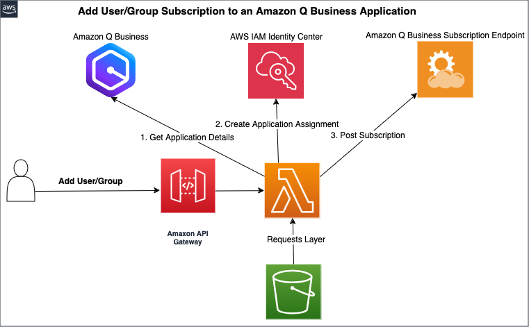
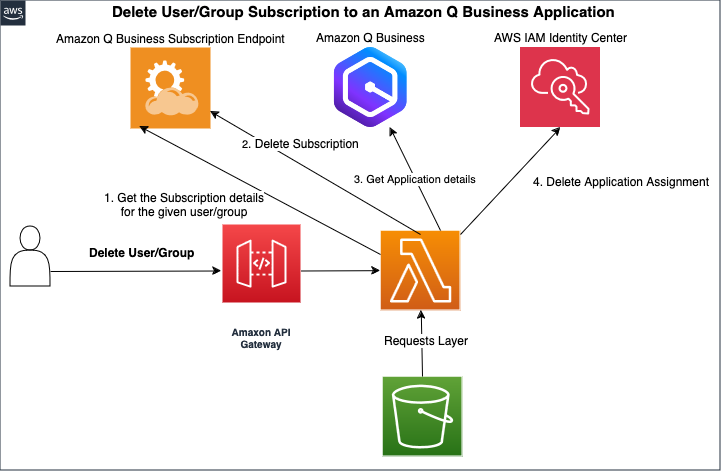

# Automating Amazon Q Business Subscription Management in AWS IAM Identity Center

Customers often want automation to assign users and groups to an Amazon Q Business application. Currently there are no APIs that support this operation.
This solution provides an automation mechanism for the operation using the console APIs.
## Workflow





## Prerequisites
Prepare the Python requests module to create a Lambda layer with the steps below.

1. Save the `requests`  Python module to a directory and zip it.

```
mkdir library
pip install -t library requests
zip -r9 python_requests_layer.zip library
```
2. Upload the Zip file from Step 1 to an S3 bucket.

## Installation

Deploy the CloudFormation template `user-group-subscription-template.yaml` with the S3 bucket having the request zip file as input.

The output from the template will include the API Gateway endpoint. Use the HTTPS endpoint to make POST calls to Add a subscription and DELETE to Delete a subscription.

### POST Request (Add Subscription)
The request body should be a JSON object with the following fields:
```json
{
    "region": "string",         // AWS region (e.g., "us-east-1")
    "applicationId": "string",  // Q Business Application Id
    "assignmentType": "string", // Must be either "GROUP" or "USER"
    "assignmentId": "string",   // Group ID or User ID from IAM Identity Center
    "subscriptionType": "string" // Must be either "Q_BUSINESS" or "Q_LITE"
}

````
E.g. 
```
curl -X POST \
  'API_END_POINT \
  -H "Content-Type: application/json" \
  --aws-sigv4 "aws:amz:us-east-1:execute-api" \
  --user "${AWS_ACCESS_KEY_ID}:${AWS_SECRET_ACCESS_KEY}" \
  -H "X-Amz-Security-Token: ${AWS_SESSION_TOKEN}" \
  -d '{"region":"{region}","applicationId":"{Q Business Application Id}","assignmentType":"GROUP|USER","assignmentId":"Group ID|User Id","subscriptionType":"Q_BUSINESS|Q_LITE"}'
```
### DELETE request (Delete Subscription)

The following query parameters must be included in the URL:

```
region: AWS region (e.g., "us-east-1")

applicationId: Q Business Application Id

assignmentType: Must be either "GROUP" or "USER"

assignmentId: Group ID or User ID from IAM Identity Center
```

E.g.
```

curl -X DELETE \
  'API_END_POINT?region={region}&applicationId={Q Business Application Id}&assignmentType=GROUP|USER&assignmentId=Group ID|User Id' \
  --aws-sigv4 "aws:amz:us-east-1:execute-api" \
  --user "${AWS_ACCESS_KEY_ID}:${AWS_SECRET_ACCESS_KEY}" \
  -H "X-Amz-Security-Token: ${AWS_SESSION_TOKEN}"

```

## Cleanup

1. Delete the CloudFormation template.
2. Delete the requets zip file from the S3 bucket.

## Security

See [CONTRIBUTING](CONTRIBUTING.md#security-issue-notifications) for more information.

## License

This library is licensed under the MIT-0 License. See the LICENSE file.

